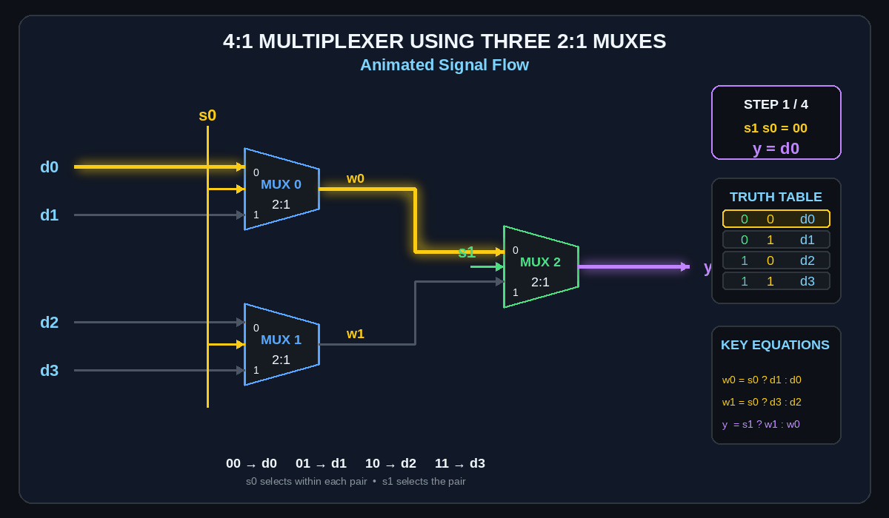

# 🔀 4:1 Multiplexer Using 2:1 MUXes — Verilog | Vivado

<p align="center">
  
</p>

<p align="center">
  <b>A hierarchical structural Verilog implementation of a 4:1 Multiplexer using three 2:1 Multiplexer modules.</b>
</p>

<p align="center">
  
  
  
  
  
</p>

<p align="center">
  
</p>

---

## 📌 Overview

This project implements a **4:1 Multiplexer using three 2:1 Multiplexer modules** in Verilog HDL.

The design uses a two-stage selection architecture:

```text
Stage 1
d0 ──┐
     ├──► MUX 0 ──► w0
d1 ──┘

d2 ──┐
     ├──► MUX 1 ──► w1
d3 ──┘

Stage 2
w0 ──┐
     ├──► MUX 2 ──► y
w1 ──┘
```

`s0` controls the two first-stage MUXes, while `s1` controls the final MUX.

---

## 🎯 Objectives

* Design a 4:1 Multiplexer from 2:1 MUX building blocks
* Implement the design using Verilog HDL
* Use hierarchical structural design
* Verify functionality using a simulation testbench
* Generate and analyze the RTL schematic
* Apply FPGA pin constraints using XDC
* Implement and verify the design on FPGA hardware

---

## 🧠 2:1 MUX Building Block

A 2:1 MUX selects one of two inputs according to a select signal.

Its basic logic can be expressed using the Verilog **ternary operator**:

```verilog
assign y = sel ? b : a;
```

The general syntax is:

```text
condition ? value_if_true : value_if_false
```

Therefore:

```text
sel = 0 → y = a
sel = 1 → y = b
```

This simple building block is used three times to construct the 4:1 MUX.

---

## 🏗️ 4:1 MUX Architecture

The architecture consists of two selection levels.

### Stage 1

Two 2:1 MUXes independently select from two input pairs:

```text
d0 / d1 → MUX 0 → w0
d2 / d3 → MUX 1 → w1
```

Both use `s0`.

### Stage 2

The intermediate signals are passed to the final 2:1 MUX:

```text
w0 / w1 → MUX 2 → y
```

The final MUX uses `s1`.

### Complete Architecture

<p align="center">
  
</p>

---

## ⚡ Signal Flow

The complete selection process is:

```text
s1 s0
 │  │
 │  └──── Stage 1 selection
 │
 └─────── Stage 2 selection
```

| `s1` | `s0` | Selected Input |  Output  |
| :--: | :--: | :------------: | :------: |
|   0  |   0  |      `d0`      | `y = d0` |
|   0  |   1  |      `d1`      | `y = d1` |
|   1  |   0  |      `d2`      | `y = d2` |
|   1  |   1  |      `d3`      | `y = d3` |

---

## 🎞️ Animated Logic Flow

The animation demonstrates the four possible selection states and highlights the active signal path.

<p align="center">
  
</p>

```text
00 → d0
01 → d1
10 → d2
11 → d3
```

---

## 🧮 Logic Decomposition

The three MUX stages can be represented compactly as:

```verilog
w0 = s0 ? d1 : d0;
w1 = s0 ? d3 : d2;
y  = s1 ? w1 : w0;
```

These equations show the complete data-selection path without reproducing the entire source file.

The complete implementation is available in:

```text
src/mux2to1.v
src/mux4_1.v
```

---

## 🧩 Hierarchical Structure

The top-level design contains three instances of the reusable `mux2to1` module:

```text
mux4_1
│
├── mux2to1 → MUX 0
├── mux2to1 → MUX 1
└── mux2to1 → MUX 2
```

Example module instantiation:

```verilog
mux2to1 m0 (
    .a(d0),
    .b(d1),
    .sel(s0),
    .y(w0)
);
```

The complete module connections are kept in the source files rather than duplicated in this README.

---

## 🧪 Simulation & Verification

The testbench is located at:

```text
sim/mux4_1tb.v
```

The simulation verifies all four possible combinations of the select signals.

### Expected Behavior

```text
s1 s0 = 00 → y = d0
s1 s0 = 01 → y = d1
s1 s0 = 10 → y = d2
s1 s0 = 11 → y = d3
```

---

## 📈 Simulation Waveform

<p align="center">
  
</p>

The waveform confirms that the output follows the input selected by `s1` and `s0`.

---

## 🖥️ RTL Schematic

The RTL schematic generated by Vivado provides a graphical representation of the synthesized design.

<p align="center">
  
</p>

The schematic allows the hierarchical MUX structure to be verified visually.

---

## 🔌 FPGA Constraints

Physical FPGA pin assignments are defined in:

```text
constraints/mux4_1c.xdc
```

The XDC file maps the logical Verilog signals to physical FPGA pins.

```text
d0 ─┐
d1 ─┤
d2 ─┤──► FPGA
d3 ─┤
s0 ─┤
s1 ─┤
y  ◄┘
```

---

## 🔬 FPGA Hardware Implementation

<p align="center">
  
</p>

The FPGA implementation demonstrates the transition from the RTL design to physical hardware.

---

## 📂 Repository Structure

```text
vivado-4to1-mux-structural/
│
├── README.md
├── LICENSE
├── .gitignore
├── create_mux_animation.py
│
├── src/
│   ├── mux2to1.v
│   └── mux4_1.v
│
├── sim/
│   └── mux4_1tb.v
│
├── constraints/
│   └── mux4_1c.xdc
│
└── docs/
    ├── mux4_1-architecture.svg
    ├── mux4_1-logic-animation.gif
    ├── rtl-schematic.png
    ├── simulation-waveform.png
    └── fpga-hardware.svg
```

---

## 🛠️ Tools & Technologies

| Tool / Technology   | Purpose                                  |
| ------------------- | ---------------------------------------- |
| **Verilog HDL**     | RTL design                               |
| **Xilinx Vivado**   | Synthesis, implementation & RTL analysis |
| **XSim**            | Functional simulation                    |
| **XDC**             | FPGA pin constraints                     |
| **FPGA**            | Hardware implementation                  |
| **Python + Pillow** | Animation generation                     |
| **Git & GitHub**    | Version control                          |

---

## 🎞️ Animation Generator

The logic-flow GIF is generated using:

```text
create_mux_animation.py
```

It produces:

```text
docs/mux4_1-logic-animation.gif
```

The Python source is included so the animation can be regenerated or modified.

---

## 📊 Design Specifications

| Parameter      |         Value |
| -------------- | ------------: |
| Data Inputs    |             4 |
| Select Inputs  |             2 |
| Output         |             1 |
| 2:1 MUX Blocks |             3 |
| Logic Type     | Combinational |
| HDL            |       Verilog |
| Simulator      |          XSim |
| FPGA Tool      | Xilinx Vivado |

---

## 🚀 Future Improvements

* [ ] Parameterized `N:1` MUX
* [ ] 8:1 MUX using 2:1 MUXes
* [ ] 16:1 MUX using 2:1 MUXes
* [ ] Gate-level implementation
* [ ] Timing analysis
* [ ] Resource utilization analysis
* [ ] Power analysis
* [ ] Behavioral vs Structural Verilog comparison
* [ ] Automated Vivado build flow

---

## 🧠 Learning Outcomes

This project provides practical experience with:

* Combinational logic design
* Multiplexer architecture
* Hierarchical RTL design
* Structural Verilog
* Module instantiation
* Ternary operators
* Testbench development
* Functional simulation
* Waveform analysis
* RTL schematic interpretation
* FPGA constraints
* FPGA implementation
* GitHub project organization

---

## 📌 Project Flow

```text
Digital Logic
      ↓
2:1 MUX Building Block
      ↓
3 × 2:1 MUXes
      ↓
4:1 MUX RTL
      ↓
Verilog Testbench
      ↓
XSim Verification
      ↓
RTL Schematic
      ↓
XDC Constraints
      ↓
FPGA Implementation
```

---

## 👥 Team

This project was collaboratively designed, simulated, documented, and implemented by:
<p align="center">
  
**Jayesh Shahare** • **Atharva Chaudhari** • **Arya Chawale** • **Urja Doshi** 

<br><br>
Electronics & Communication Engineering

<br>
Digital Logic • Verilog • FPGA • VLSI
</p>

---

<p align="center">
🔀 Select • Route • Output
<b>Built with Verilog HDL and Xilinx Vivado.</b>
</p>

<p align="center">
  
</p>
```
