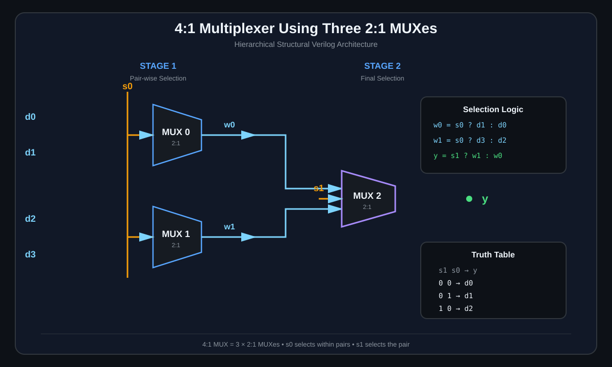
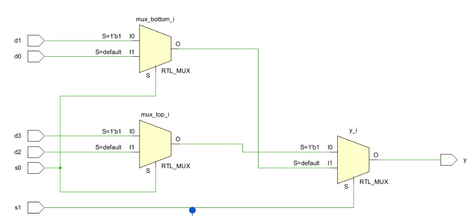
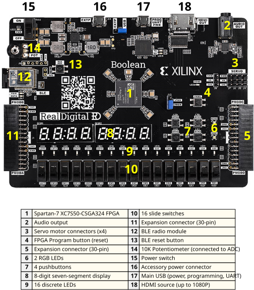

# 🔀 4:1 Multiplexer Using 2:1 MUXes — Verilog | Vivado

<p align="center">
  
</p>

<p align="center">
  <b>A hierarchical structural Verilog implementation of a 4:1 Multiplexer using three 2:1 Multiplexer modules.</b>
</p>

<p align="center">
  
  
  
  
  
</p>

---

## 📌 Project Overview

This project implements a **4:1 Multiplexer (MUX)** using **three 2:1 Multiplexer modules** in Verilog HDL.

Instead of designing the 4:1 MUX as a single block, the circuit is decomposed into smaller reusable **2:1 MUX modules** and connected hierarchically.

The design uses:

* **4 data inputs** → `d0`, `d1`, `d2`, `d3`
* **2 select inputs** → `s0`, `s1`
* **1 output** → `y`
* **3 × 2:1 MUXes**

The design was developed and simulated using **Xilinx Vivado and XSim**.

---

## 🎯 Objectives

* Understand the operation of a **4:1 Multiplexer**
* Implement a larger combinational circuit using smaller modules
* Practice **hierarchical structural Verilog**
* Understand Verilog module instantiation
* Understand the **ternary operator**
* Create and apply FPGA pin constraints using an `.xdc` file
* Verify the design through simulation
* Observe the synthesized RTL structure
* Implement the design on an FPGA board

---

# 🧠 What is a Multiplexer?

A **Multiplexer (MUX)** is a combinational digital circuit that selects one input from multiple inputs and forwards the selected input to a single output.

For a **2:1 MUX**:

```text
        ┌─────────┐
 a ────►│         │
 b ────►│  2:1    ├────► y
 sel ──►│   MUX   │
        └─────────┘
```

Its basic Boolean expression is:

```text
y = sel ? b : a
```

The Verilog ternary operator:

```text
condition ? value_if_true : value_if_false
```

provides a compact way to describe this selection logic.

---

# 🔢 4:1 Multiplexer

A 4:1 MUX contains:

```text
Inputs:
d0, d1, d2, d3

Select:
s0, s1

Output:
y
```

The two select lines determine which data input reaches the output.

### Truth Table

| `s1` | `s0` | Selected Input |  Output  |
| :--: | :--: | :------------: | :------: |
|   0  |   0  |      `d0`      | `y = d0` |
|   0  |   1  |      `d1`      | `y = d1` |
|   1  |   0  |      `d2`      | `y = d2` |
|   1  |   1  |      `d3`      | `y = d3` |

---

# 🏗️ Architecture

The 4:1 MUX is constructed using **three 2:1 MUXes**.

### Stage 1

Two 2:1 MUXes operate in parallel:

* MUX 0 selects between `d0` and `d1`
* MUX 1 selects between `d2` and `d3`
* Both are controlled by `s0`

### Stage 2

A third 2:1 MUX selects between the outputs of the first two MUXes.

* Input 0 → output of MUX 0
* Input 1 → output of MUX 1
* Select → `s1`

The resulting output is `y`.

---

## 🔀 Architecture Diagram

<p align="center">
  
</p>

### Signal Flow

```text
w0 = s0 ? d1 : d0
w1 = s0 ? d3 : d2

y  = s1 ? w1 : w0
```

Therefore:

```text
s1 s0
│  │
│  └── selects between inputs within each pair
│
└───── selects between the two intermediate results
```

---

# 🧩 Hierarchical Design

The project is divided into reusable modules.

```text
                 mux4_1
                    │
        ┌───────────┼───────────┐
        │           │           │
       MUX0        MUX1        MUX2
       2:1         2:1         2:1
        │           │           │
      d0,d1       d2,d3       w0,w1
        │           │           │
       s0          s0          s1
```

### Module hierarchy

```text
mux4_1
 ├── mux2to1 m0
 ├── mux2to1 m1
 └── mux2to1 m2
```

This approach makes the design:

* Modular
* Reusable
* Easier to debug
* Easier to extend
* Easier to understand at RTL level

---

# 💻 Verilog Design Approach

The complete source code is available in the repository under:

```text
src/
├── mux2to1.v
└── mux4_1.v
```

Rather than duplicating the complete source code here, the important concept is the **2:1 MUX selection operation**:

```verilog
assign y = sel ? b : a;
```

Here:

```text
sel = 0 → y = a
sel = 1 → y = b
```

The 4:1 MUX then reuses this basic building block three times.

For example, one of the hierarchical connections is:

```verilog
mux2to1 m0 (
    .a(d0),
    .b(d1),
    .sel(s0),
    .y(w0)
);
```

This connects the first 2:1 MUX to:

```text
d0 ──┐
     ├── MUX0 ──► w0
d1 ──┘
      ▲
      │
      s0
```

The remaining module connections can be found in:

**`src/mux4_1.v`**

---

# 🧮 Logic Decomposition

The circuit can be understood as three simple operations.

### First 2:1 MUX

```text
w0 = s0 ? d1 : d0
```

### Second 2:1 MUX

```text
w1 = s0 ? d3 : d2
```

### Final 2:1 MUX

```text
y = s1 ? w1 : w0
```

Combining these stages gives the complete 4:1 selection behavior:

```text
s1 s0 = 00 → d0
s1 s0 = 01 → d1
s1 s0 = 10 → d2
s1 s0 = 11 → d3
```

---

# 🧪 Verification

The design is verified using a Verilog testbench.

Testbench location:

```text
sim/mux4_1tb.v
```

The testbench applies different combinations of:

* Data inputs
* Select inputs

and observes the resulting output.

### Required Select Combinations

```text
00 → d0
01 → d1
10 → d2
11 → d3
```

The testbench therefore verifies that the output follows the correct selected input.

---

# 📈 Simulation Waveform

The expected simulation demonstrates the four possible select combinations.

<p align="center">
  
</p>

### Verification Summary

| Select | Expected Output |
| :----: | :-------------: |
|  `00`  |       `d0`      |
|  `01`  |       `d1`      |
|  `10`  |       `d2`      |
|  `11`  |       `d3`      |

If the waveform follows these four cases correctly, the functional behavior of the 4:1 MUX is verified.

---

# 🖥️ RTL Schematic

Vivado can generate an RTL schematic showing how the hierarchical modules are connected.

<p align="center">
  
</p>

The schematic should show the three 2:1 MUX stages forming the complete 4:1 MUX.

---

# 🔌 FPGA Implementation

The design can be mapped to an FPGA using an XDC constraints file.

Constraint file:

```text
constraints/mux4_1c.xdc
```

The constraints define the physical FPGA pins associated with:

```text
d0
d1
d2
d3

s0
s1

y
```

This allows the logical Verilog design to interact with physical FPGA inputs and outputs such as switches and LEDs.

---

# 📷 Hardware Implementation

<p align="center">
  
</p>

The hardware implementation demonstrates the mapping between the logical MUX design and the physical FPGA board.

For example:

```text
FPGA Switches
     │
     ▼
d0 d1 d2 d3
s0 s1
     │
     ▼
  4:1 MUX
     │
     ▼
    LED
```

---

# 📁 Repository Structure

```text
vivado-4to1-mux-structural/
│
├── README.md
├── LICENSE
├── .gitignore
│
├── src/
│   ├── mux2to1.v
│   └── mux4_1.v
│
├── sim/
│   └── mux4_1tb.v
│
├── constraints/
│   └── mux4_1c.xdc
│
└── docs/
    ├── mux4_1-architecture.svg
    ├── rtl-schematic.png
    ├── simulation-waveform.png
    └── fpga-hardware.svg
```

---

# 🛠️ Tools & Technologies

| Tool / Technology | Purpose                                      |
| ----------------- | -------------------------------------------- |
| **Verilog HDL**   | Hardware description                         |
| **Xilinx Vivado** | Synthesis, implementation & FPGA development |
| **XSim**          | Functional simulation                        |
| **XDC**           | FPGA pin constraints                         |
| **FPGA Board**    | Hardware implementation                      |
| **Git / GitHub**  | Version control & project sharing            |

---

# 🔍 Design Characteristics

### Type

```text
Combinational Logic
```

### Inputs

```text
4 Data Inputs
2 Select Inputs
```

### Output

```text
1 Output
```

### Building Blocks

```text
3 × 2:1 MUX
```

### Logic Depth

```text
2 MUX levels
```

The first level performs pair-wise selection, while the second level selects between the two intermediate results.

---

# 💡 Why Use 2:1 MUXes?

A larger multiplexer can be constructed from smaller multiplexers.

For a 4:1 MUX:

```text
Number of 2:1 MUXes = 3
```

Generalizing this idea:

```text
8:1 MUX → 7 × 2:1 MUXes
16:1 MUX → 15 × 2:1 MUXes
```

In general:

```text
Number of 2:1 MUXes = N - 1
```

for an `N:1` MUX when `N` is a power of two.

This demonstrates how complex digital logic can be constructed from smaller reusable building blocks.

---

# 📚 What I Learned

Through this project, the following concepts were explored:

* Digital multiplexer architecture
* 2:1 and 4:1 MUX operation
* Truth tables
* Combinational logic
* Verilog HDL
* Ternary operators
* Hierarchical module design
* Structural Verilog
* Module instantiation
* Testbench development
* Functional simulation
* XSim waveform analysis
* RTL schematic generation
* FPGA pin constraints
* Synthesis and implementation
* GitHub project organization

---

# 🚀 Possible Improvements

Future versions of this project could include:

* Parameterized `N:1` multiplexer design
* Generic MUX generation using Verilog parameters
* Larger 8:1 and 16:1 MUX architectures
* Gate-level implementation
* Timing analysis
* Resource utilization analysis
* FPGA timing constraints
* Automated simulation scripts
* Hardware demonstration video/GIF
* Comparison between behavioral and structural implementations

---

# ✅ Project Checklist

* [x] Design 2:1 MUX
* [x] Build 4:1 MUX using 2:1 MUXes
* [x] Create hierarchical Verilog modules
* [x] Create simulation testbench
* [x] Verify all select combinations
* [x] Generate RTL schematic
* [x] Create FPGA constraints
* [x] Synthesize design
* [x] Implement on FPGA
* [x] Organize source files for GitHub
* [x] Add architecture visualization
* [x] Document the project

---

# 📌 Key Concept

The entire design can be reduced to one simple idea:

```text
              4:1 MUX
                 │
       ┌─────────┴─────────┐
       │                   │
    Pair 0              Pair 1
    d0 / d1             d2 / d3
       │                   │
       └───────┐   ┌───────┘
               ▼   ▼
                MUX
                 │
                 ▼
                 y
```

The first select line `s0` chooses an input **within each pair**, while the second select line `s1` chooses **which pair reaches the output**.

---

# 👨‍💻 Author

**Urja Doshi**

Electronics & Communication Engineering
Digital Logic • Verilog • FPGA • VLSI

---

# ⭐ Support

If you found this project useful for learning digital logic, Verilog, or FPGA design, consider giving the repository a ⭐.

---

<p align="center">

### 🔀 Select. Route. Output.

**Built with Verilog HDL and Xilinx Vivado.**

</p>

<p align="center">
  
</p>
